# Forest Diorama（Godot 4.7）

一塊浮空的方形森林小地台：起伏草地、蜿蜒小徑、小池塘（獨木舟、睡蓮）、紅帳篷營地、茂密樹林。
長焦鏡頭 + 景深模糊做微縮模型感。全部程式生成。
- 樹、草叢、灌木、蕨類、花、蕈菇、岩石、倒木、樹樁：`tools/gen_assets.py` 用 Blender 生成（`assets/gen/`，33 個）
  - 樹是 L4「純葉片」等級：每棵 220 片 6 頂點葉子 + 深色內核，約 6k–15k 三角形，葉子會隨風擺動
  - **葉子的法線不是葉片本身的方向，而是「從樹冠中心往外」的球面法線**（Blender custom split normals），
    所以剪影是一片片葉子、受光卻像一顆球一樣平滑——這是低模風格「幾何高頻、光影低頻」的關鍵
- 營地：`tools/proplib.py` 用 Blender 生成（單位 = 公尺，場景內 scale 1）
  - **露營車：Q 版復古露營車（鳥山明 × 薩爾達 Diorama，方正版）**。上下兩截圓角盒子（`_loft_rounded`）：
    下截薄荷綠（挖輪拱）、上截奶油黃，接縫是鍍鉻腰帶；3.0 m 長、1.85 m 高、圓角半徑 0.11（方正但不出現尖角）。
    前後臉是平的，**前擋是臉上真正開的大圓角矩形孔**（`B.cap_with_hole` 用 `bridge_loops` 把放樣末端環橋接到洞邊），
    寬度幾乎佔滿整張臉、高度＝側窗帶；**A 柱／C 柱兩側各有一扇環繞角窗**（放樣最前／最後 0.36 m 的側窗帶面換玻璃），
    和前擋、後窗連成環繞式視野；每側再兩扇側窗；框都是沿開孔邊界繞的鍍鉻管。
    **內裝**：車殼材質雙面（內壁就是車身色）、深色地板、珊瑚粉座椅＋頭枕、方向盤、儀表板、後床；玻璃 alpha 0.14、
    specular 0.15——透過大前擋看得到座椅（`preview_diorama_van_interior.png` 是從前擋往裡看）。
    腰帶線上兩顆圓頭燈（鍍鉻框 + 燈泡 + 半透明燈罩 `headlightGlass`，夜晚自發光）；小胖氣球胎（外徑 0.6）；
    圓角行李架上睡袋＋保冷箱；薄荷／奶油條紋遮陽棚。
    型錄：`preview_asset_van.png`、`preview_asset_van_front.png`、`preview_asset_van_side.png`（豆子版／cab-over／T1 都還在 proplib 裡，沒匯出）
  - **帳篷：Coleman Tough Dome 風格**。圓角方形圓頂（超橢圓 p=3.2）、兩根對角交叉營柱、綠外帳／卡其內帳／深灰浴缸底、
    D 形網門與側網窗（貼在圓頂表面的曲面片，帶米色拉鍊邊）、兩根柱子撐起的前庭雨棚、地布、門口踏墊、營繩地釘、頂部通風口。
    型錄：`preview_asset_tent.png`
  - 器具：三張折疊椅（面向營火）、木桌（馬克杯／盤子／水瓶／發光露營燈）、保冷箱、木箱、營火（發光火焰＋點光源）、
    三腳架吊水壺、帳篷頂→車頂的彩色串燈（`_string_lights()`）
  - 型錄：`preview_assets_camp.png`；位置常數 `TENT / FIRE / TABLE / VAN / VAN_ROT` 在 `forest.gd` 頂部
  - 營地與車子下方有**地形平整墊**（`PADS`，`h()` 把 `_h_raw()` 往墊中心高度混合），道具才不會一邊懸空
  - 營地有一顆 `ReflectionProbe`（box projection），鍍鉻與玻璃反射周圍的樹
- 獨木舟、睡蓮、告示牌、柴堆：Kenney Nature Kit（CC0，`assets/nature/`）
- **Q 版露營者（第二代，`tools/camperlib.py`）**，風格參考《薩爾達傳說 智慧的再現》的塑膠玩具人偶：
  - 身體：火柴人骨架（`JOINTS` 關節位置＋半徑）用 Blender **Skin modifier 長肉**、Subdivision 細分，肩髖膝肘自然相連，
    不再是棍子插球；材質區用高度與最近骨頭切（外套下襬 0.455 m）
  - 骨架：照同一份關節表建 Armature（`BONES`），權重 = 最近的骨頭、關節附近兩根混合；匯成 glTF skin
  - 臉：**numpy 畫到貼圖**（深色橢圓眼＋高光、眉毛、腮紅、小鼻、小嘴、鋸齒瀏海＋鮑伯頭），兩格（睜眼｜閉眼），
    Godot 端 `uv1_offset.x` 切 0.5 就眨眼；材質名 `face` 不換色只調光澤
  - 三套服裝（`OUTFITS`）：散步的天藍羽絨＋綠毛帽、烤棉花糖的芥末黃＋紅毛帽、手沖的梅紫刷毛＋橄欖漁夫帽
  - Godot 端 `scripts/rig.gd` 用程式擺姿勢：每根骨頭給「head 位置＋方向」→ 最小旋轉疊在 rest 上（不用管 bone roll），
    腿、手臂兩段式解析 IK；烤棉花糖的坐在紅椅上（髖在椅面、小腿垂下、右手握棍慢慢轉），手沖的站在木箱上
    每 7 秒倒一次（壺嘴水柱落到濾杯口）；棍子、壺、杯用 `BoneAttachment3D` 掛在手骨上；沖好的那杯與三腳架水壺冒蒸氣
- **環境音**（`tools/gen_audio.py`，純 numpy 合成、不用任何素材）：風、鳥、蟋蟀＋貓頭鷹是不定位的環境層，
  營火與池塘是 3D 音源（鏡頭推近營地火聲變大）；五層音量跟著日／黃昏／夜一起漸變（`TOD_PRESETS` 的 `a_*`），**M** 靜音

- **池塘水面**（`WATER_SHADER`）：用螢幕深度算水深——淺灘透出折射過的沙底、深處轉深藍；岸邊與獨木舟、睡蓮接觸處一條會動的細水線；
  三層流動的 value noise 當漣漪法線，太陽反光碎成閃點、反射探針裡的樹在水面上晃；水面不吃漫射光（樹影不會印在水上），
  亮度跟著日夜漸變

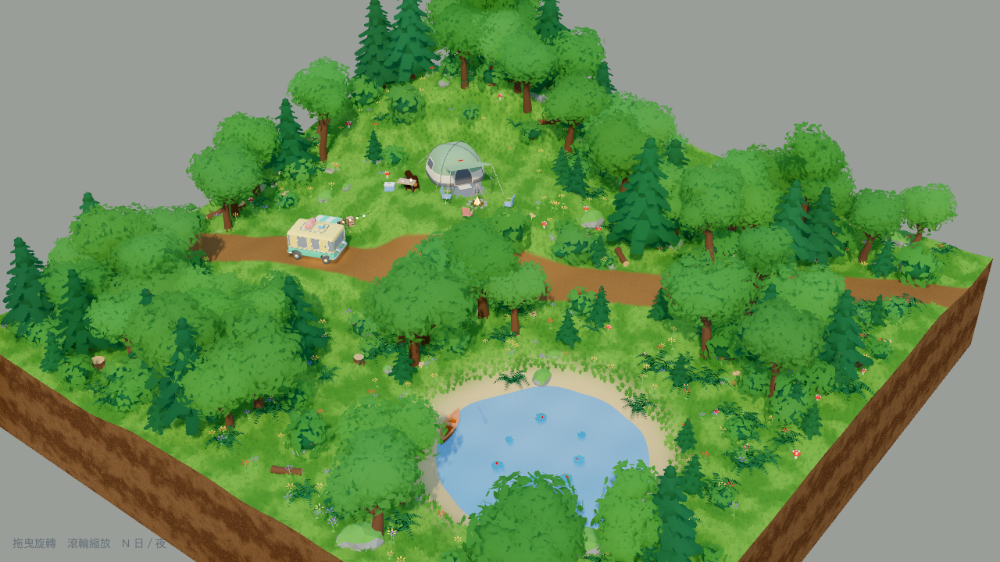
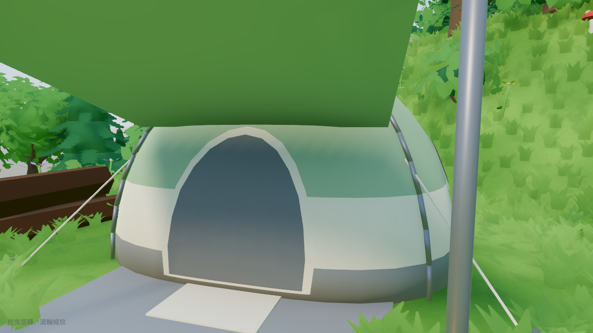
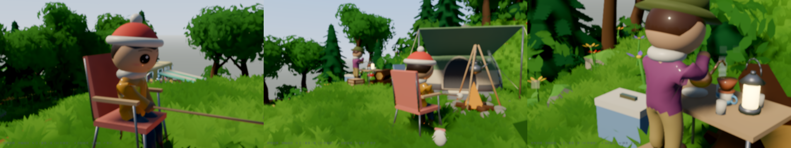
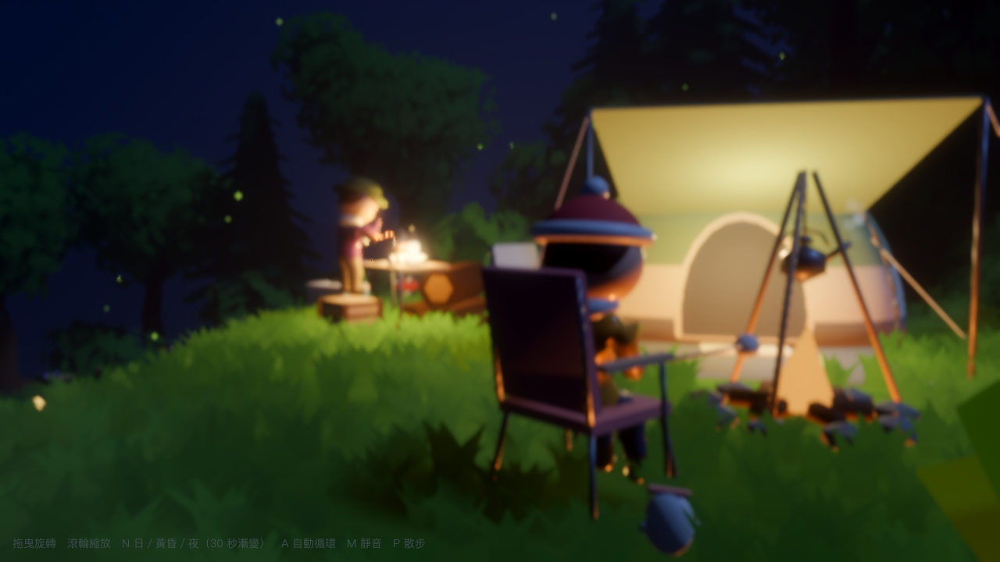
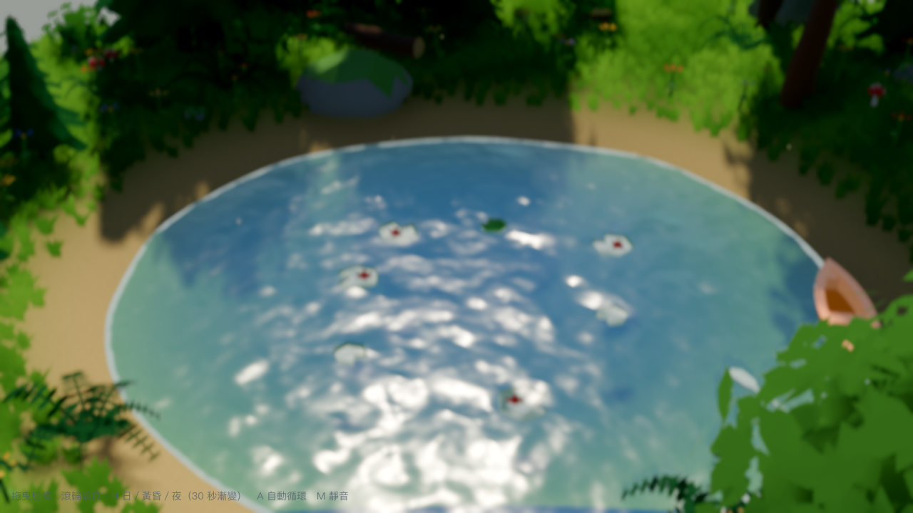
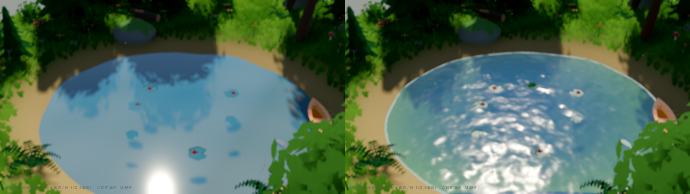

## 散步模式（實驗）
按 **P**：鏡頭從環繞視角俯衝下來，變成跟著一個 Q 版露營者（`assets/gen/camper_walk.glb`，`scripts/walker.gd`）的第三人稱視角，
WASD／方向鍵相對鏡頭方向走、Shift 跑、拖曳轉鏡頭、滾輪拉遠近，再按 P 回到環繞視角（原本的角度與距離會還原）。
這是用來回答「這個專案要當擺件還是可以走進去的世界」的實驗：走十分鐘，答案自己會出來。

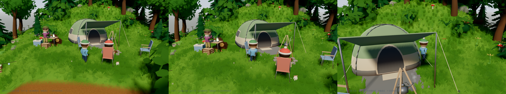

- 高度直接跟地形函式 `h()`（不靠物理地板，所以和地面網格完全貼合）；走進池塘會涉水到小腿，水線會自動繞著腳
- `move_and_slide` 只處理水平碰撞：`_build_colliders()` 只放「走過去會穿幫」的大東西——樹幹（6 m 高的圓柱）、
  露營車、帳篷、桌椅、營火、木箱、大石、告示牌；灌木花草直接穿過
- **走路是腳步落點式的程序動畫**（`scripts/walker.gd` + `rig.gd`）：每隻腳在「落後髖部半步」時才抬起、落到預測的下一步位置
  （腳踩住地面不滑），膝蓋由兩段式 IK 決定；骨盆隨步伐起伏、往支撐腳側移、往擺動腿方向扭，脊椎反扭，手臂跟對側腳同步擺、
  手肘在前擺時多彎一點；跑步前傾、轉彎內傾；停下來多走一小步把腳收回髖下；閒置有呼吸、換重心、東張西望、眨眼
- 第三人稱鏡頭的遮擋，三層：對樹幹／道具射線擋到就縮短距離（最近到 0.9 m，快變第一人稱）、不鑽進地形；
  **樹葉沿「鏡頭→角色」這條線段用抖動淡出**（`LEAF_SHADER` 的 `cam_pos / cam_target / cam_fade`，用世界座標算距離，陰影 pass 不受影響）；
  擠到鏡頭前 1.8 m 內的樹幹、1.1 m 內的角色自己用 `StandardMaterial3D` 的 distance fade（pixel dither）淡出
- 散步時景深放寬（遠處 30 m 才開始糊），不然前方森林是一片霧
- headless 測試：`Godot --headless --path . --script res://tests/walk_test.gd`（地形貼合、撞車擋得住、涉水、離開模式還原鏡頭）
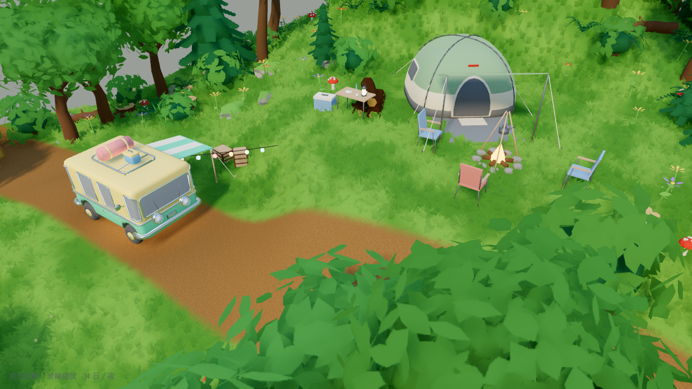
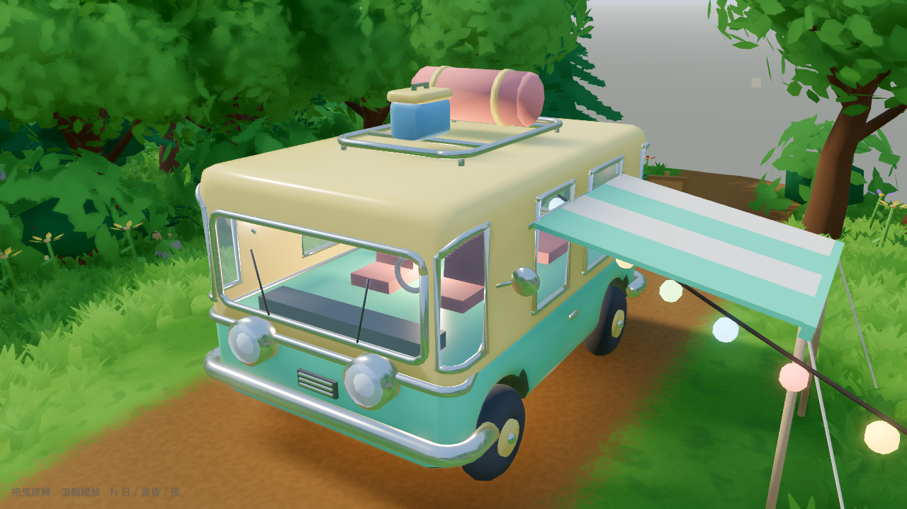


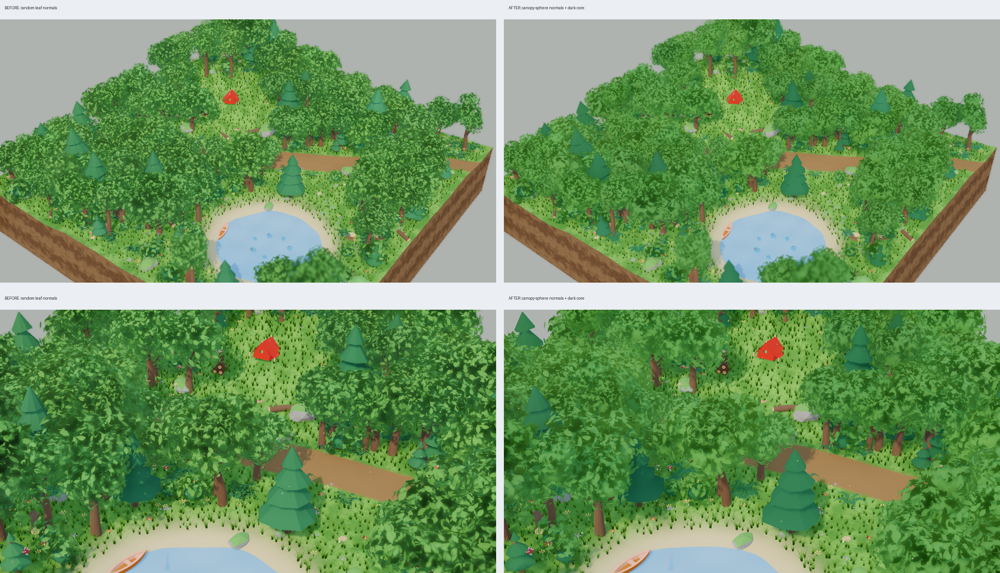
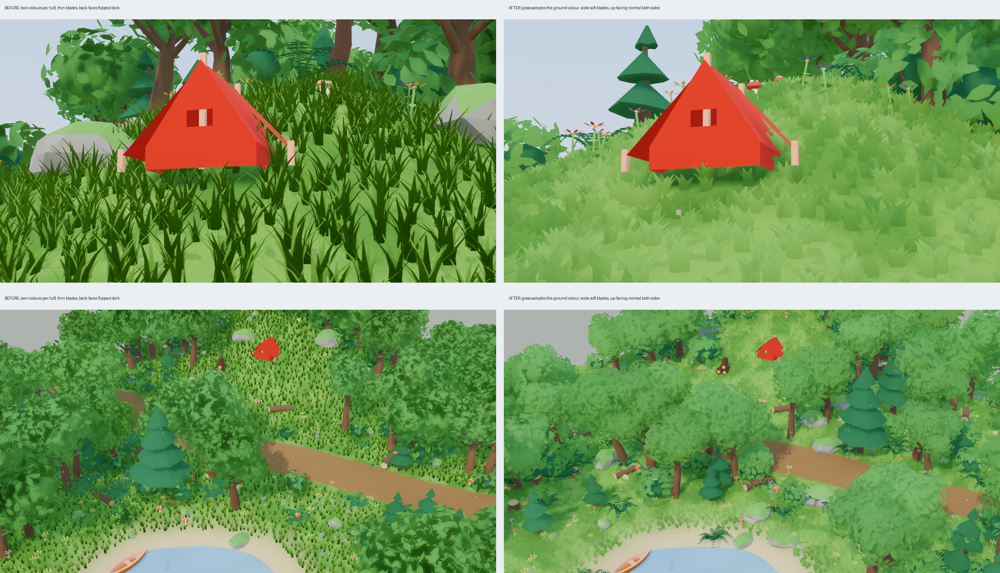
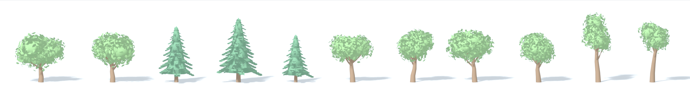
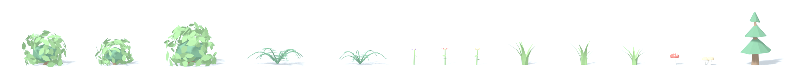
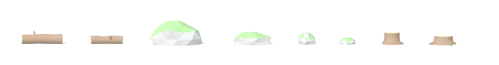

## 重新生成資產（Blender）
```
B=/Applications/Blender.app/Contents/MacOS/Blender
$B --background --python tools/gen_assets.py -- "$PWD/assets/gen"              # 預設 L4 leaves + leaf6
$B --background --python tools/gen_assets.py -- "$PWD/assets/gen" hybrid       # 較省效能的 L3
$B --background --python tools/lineup.py -- "$PWD/assets/gen" out.png "tree_"  # 型錄圖（可用前綴篩選）
$B --background --python tools/leaf_levels.py -- out.png                        # 六種葉子做法比較
$B --background --python tools/leaf_shapes.py -- out.png                        # 三種葉形比較
$B --background --python tools/gen_assets.py -- "$PWD/assets/gen" only=camper,coffee   # 只生成名稱符合前綴的（改角色不用重跑整批樹）
PY=$(ls -d /Applications/Blender.app/Contents/Resources/*/python/bin/python3* | head -1)   # 系統 python 沒 numpy，借 Blender 的
$PY tools/gen_audio.py audio && for f in wind birds crickets fire water; do ffmpeg -y -i audio/$f.wav -c:a vorbis -strict -2 -q:a 5 audio/$f.ogg; done && rm audio/*.wav
Godot --headless --path . --import                                              # 新增的資產要先讓 Godot 匯入一次
```
- `tools/gen_audio.py`：所有濾波在頻域做（rfft × 響應 → irfft ＝ 循環卷積），慢速起伏用整數週期的正弦，
  事件超出尾端就繞回開頭——每段天生就是無縫循環。ffmpeg 內建的 Vorbis 編碼器只收雙聲道，所以 WAV 一律輸出立體聲。
- `tools/proplib.py`：營地道具（`glamping_tent / camper_van / camp_chair / camp_table / lantern / campfire / tripod_kettle / crate / cooler`），
  用小型建模器 `B`（box / cyl / rod / prism / tri，`use(mat)` 指定材質）拼出來；材質名稱在 Godot 端由 `PROP_MATS` 調質感
- `tools/treelib.py` 是生成函式庫：`tree_broadleaf / tree_pine_detailed / grass_tuft / bush / fern / flower / mushroom / rock / log_ / stump`
  - 針葉樹：枝條沿樹幹黃金角螺旋排列（不分層，剪影才連續）、每根枝條 8 片扁平扇形葉束（每片兩側各一片側葉束）（外緣鋸齒暗示針葉，
    一片片疊成羽狀，微微下垂）、內核 4 段圓錐；針葉的受光法線 = 從樹軸往外 + 往上，整棵像一個圓錐平滑受光。
    型錄：`preview_assets_pines.png`
- 改 `gen_assets.py` 底部的參數就能換樹型；材質名稱要維持 Kenney 的命名（`woodBark / leafsGreen / grass …`），
  Godot 的 `PALETTE` 才會套色
- 葉子材質（`leafsGreen / leafsDark`）在 Godot 端會換成 `LEAF_SHADER`：雙面、乘頂點色、隨風擺動

## 效能（M1，1280×720）
| 樹的等級 | fps |
|---|---|
| L0 blob（葉團） | ~60 |
| L3 hybrid | ~50 |
| L4 leaf6，181 棵樹 | ~38（陰影已降為 2 層） |
| L4 leaf6，81 棵樹 + 16k 叢草 | ~125 |
| **+ L4 針葉樹、L4 林下植被、營地道具（目前）** | **~40** |

`Godot --path . -- --bench` 會跑 6 秒後印出 fps；`--tree-dir=<資料夾>` 可換一組樹來比。
**注意**：同一內容連跑幾次數字會在 44 / 88 / 144 之間跳（GPU 時鐘狀態或第一次啟動在編譯 shader），
看趨勢要跑 3 次取最好的那次。

樹與草的密度在 `_build_forest()`（`spacing`、`forest_density * 0.7`）和 `_build_grass()`（`spacing`、跳過率）調。

## 日／黃昏／夜切換（10 秒漸變）
按 **N** 循環（命令列 `-- --dusk` / `-- --night` 是瞬間切）。三個時段的所有參數在 `TOD_PRESETS` 一張表裡
（天空四色、環境光、曝光、glow、體積霧、太陽角度／顏色／強度、各營燈與車燈、螢火蟲、自發光），
`set_time()` 把目前狀態和目標狀態逐項插值（float / Color / Vector3），smoothstep 10 秒完成，
每一幀 `_apply_state()` 一次寫回。環境光一律用純色（`AMBIENT_SOURCE_COLOR`），才能在三個時段間平滑插值。
- **A 自動循環**（`--auto`）：每個時段停 60 秒、漸變 30 秒，一圈 270 秒（當擺件放著看的節奏；`AUTO_HOLD` / `tod_duration`）。
- **太陽／月亮換手**：黃昏→夜、夜→日時光源不是在天上滑過去，而是先落到地平線下（碰到地平線就熄），
  另一顆再從對面升起；中間那段靠「暮光」撐著——環境光補一段、地平線留一抹餘暉（`_lerp_state` 的 `sun_body` 分支）。
- **閃爍**（`_flicker()`）：營火光與火焰自發光用三個不成比例的正弦疊出呼吸感；火焰網格本身換成 `FLAME_SHADER`
  （頂點隨時間扭動：底部不動、越往上擺越多、整體高度呼吸）；露營燈微顫；串燈每顆不同相位慢慢呼吸；
  串燈亮度也跟時段走（白天 0.5 → 夜晚 3.0）。

## 展示影片
`video/demo.mp4`（30 秒、1920×1080、30 fps、H.264 + AAC 環境音、約 72 MB；不進 git，用下面的指令重新輸出）。

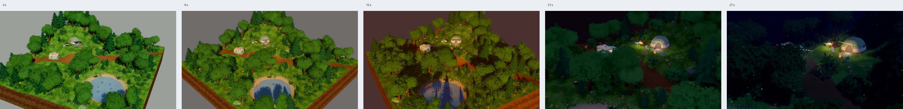
`--demo=30` 模式：鏡頭廣角慢繞 → 推進到營地 → 低角度環繞營火，
時段壓縮成 0–5 s 白天 → 8 s 轉黃昏 → 4 s 黃昏 → 8 s 轉夜 → 5 s 夜，HUD 隱藏，結束自動關閉。重新輸出：
```
printf '[display]\nwindow/size/viewport_width=1920\nwindow/size/viewport_height=1080\n' > override.cfg
Godot --path . --write-movie video/demo.avi --fixed-fps 30 --quit-after 915 -- --demo=30
rm override.cfg
ffmpeg -i video/demo.avi -vf "fps=30,format=yuv420p" -c:v libx264 -crf 17 -c:a aac -b:a 160k -movflags +faststart video/demo.mp4
```
（Movie Maker 寫 MJPEG AVI 並把環境音一起錄進去，再用 ffmpeg 轉 H.264／AAC；`--demo=N` 的排程與運鏡都以 N 的比例算，改秒數就會等比縮放。
**Movie Maker 的輸出尺寸 = 專案的 viewport 設定**，`--resolution` 或程式裡改視窗大小都不會影響它，
要 1080p 得用 `override.cfg` 暫時蓋掉專案設定。）

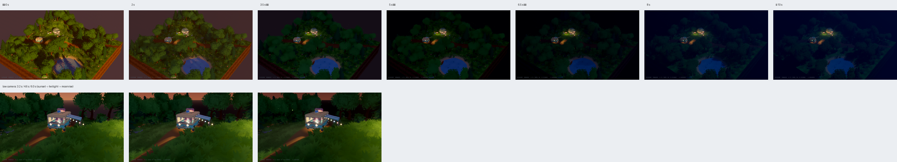

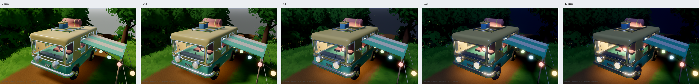

- **白天**：藍天、暖白太陽 44°。
- **黃昏（golden hour）**：太陽貼近地平線 18°、橘金色主光 + 薰衣草色純色補光（`AMBIENT_SOURCE_COLOR`，
  不用天空當環境光——否則整個場景會被橘紅天際染成火星）、天空上紫下桃、畫出太陽圓盤、長影子、淡暖霧；
  營燈剛亮、車燈半亮、螢火蟲開始出來。
- **夜晚**：深藍天空、冷色月光、體積霧；**車頭燈全開**（SpotLight + 燈罩自發光 + 尾燈）、車內燈、營火變旺、
  露營燈、帳篷門口燈、串燈；螢火蟲滿天。

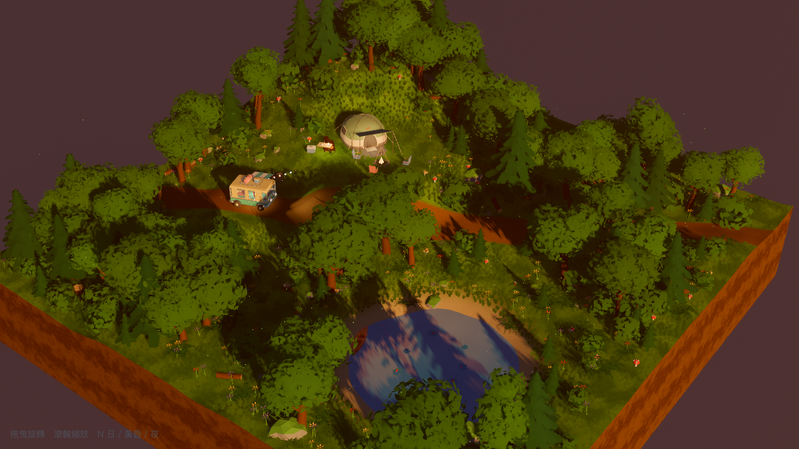
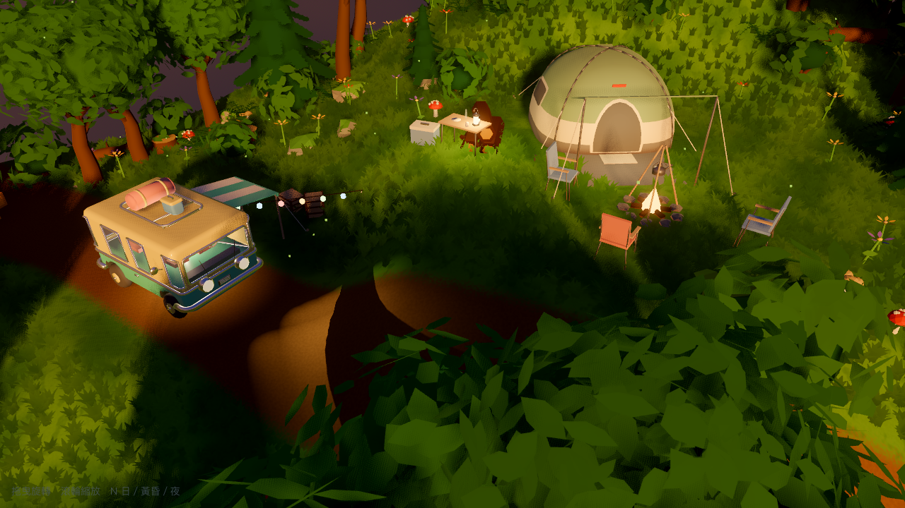
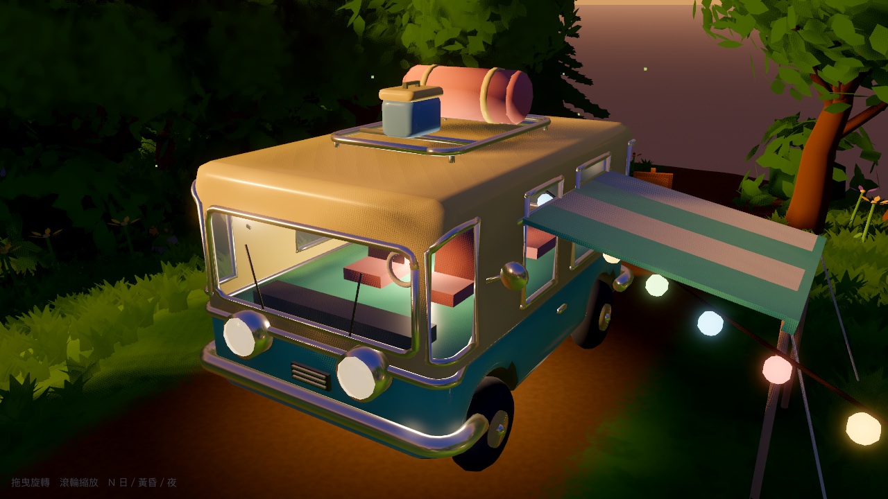
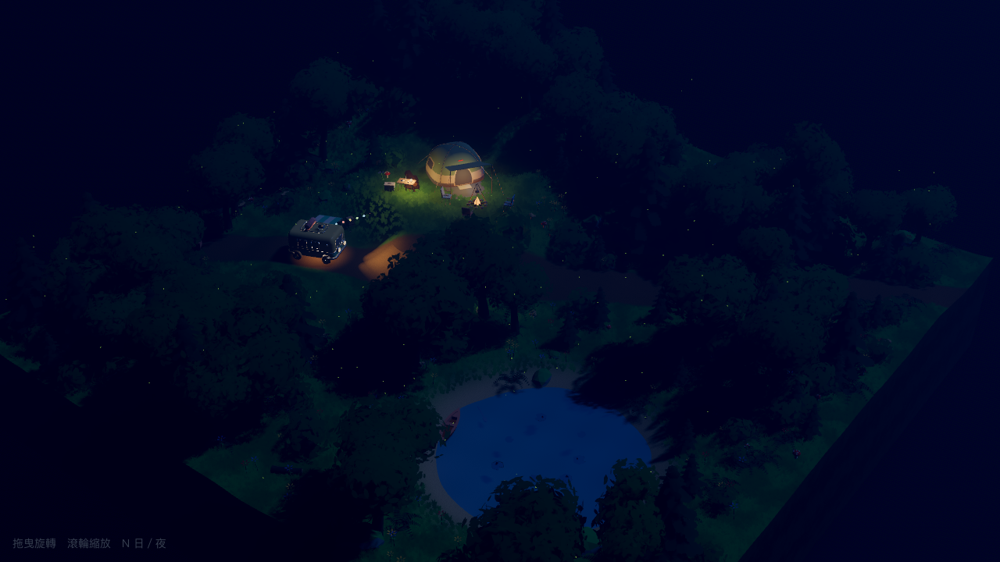
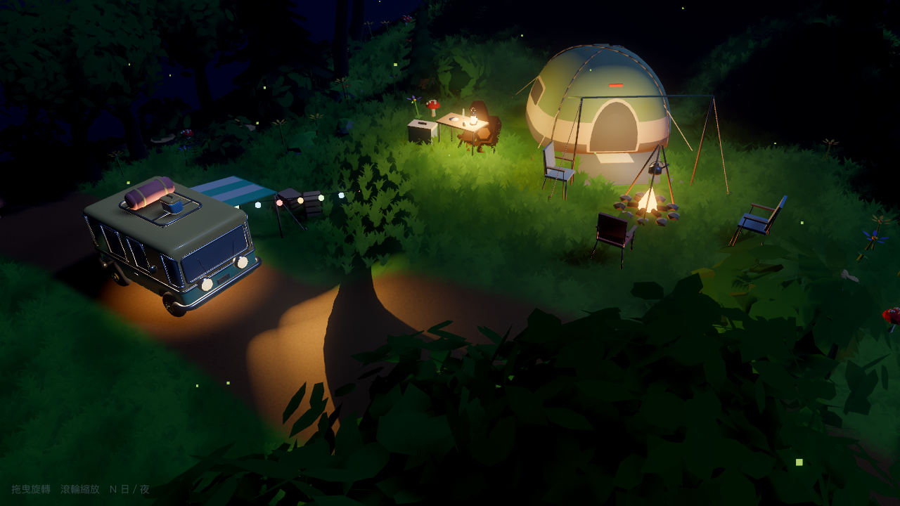
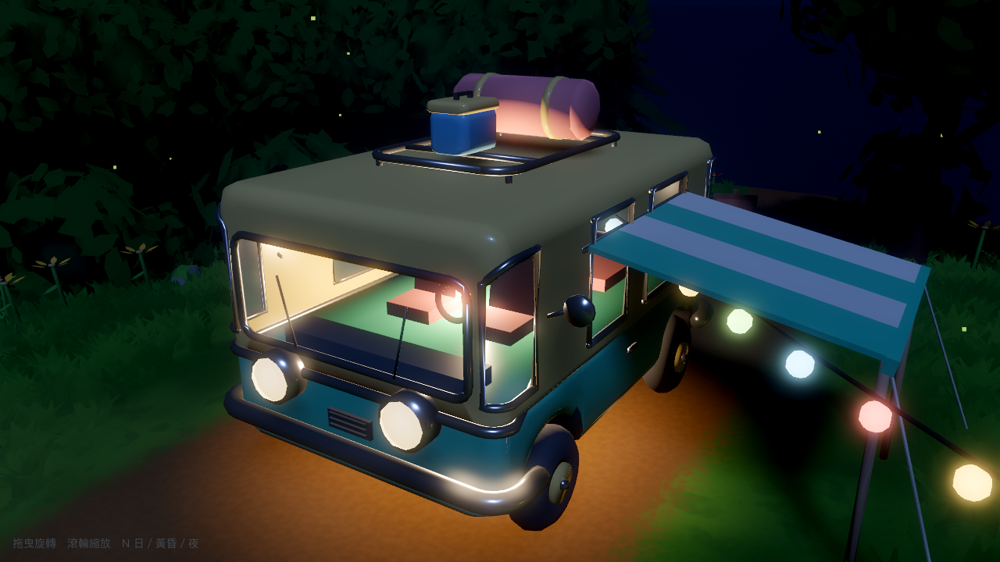

## 執行
- 用 Godot 開這個資料夾，按 **F5**；或命令列 `Godot --path .`
- 操作：**滑鼠拖曳**環繞、**滾輪**縮放；放著不動 4 秒會緩慢自轉；**N** 日／黃昏／夜、**A** 自動循環、**M** 靜音、**P** 散步模式

## 檔案
- `forest.tscn` + `scripts/forest.gd` — Diorama 場景（主場景）
  - `h()` 地形高度、`_build_ground()` 地台與土層側面、`_build_water()` 池塘
  - `_build_grass()` 草叢 MultiMesh（隨風搖）、`_build_forest()` 樹林、`_build_understory()` 灌木蕨類花草石頭
  - `_build_props()` 營地／池塘擺設、`_setup_env()` 光線與背景、`_build_camera()` 環繞鏡頭與景深
  - `_build_campers()` 兩個露營者（`place_scene()` 保留 GLB 節點階層）、`_campers_tick()` 程式動畫、`_steam()` 蒸氣粒子
  - `_build_audio()` 環境音（`audio/*.ogg`，循環）、`_style_mesh()` 材質替換（`kenney_mesh` 與 `place_scene` 共用）
  - `_build_colliders()` 散步碰撞、`toggle_walk() / _enter_walk() / _exit_walk()` 散步模式、`_apply_camera()` 第三人稱鏡頭遮擋
- `scripts/walker.gd` — 散步模式的角色控制與腳步落點式走路；`scripts/rig.gd` — 程序動畫骨架（IK、姿勢、眨眼）
- `tools/camperlib.py` — 第二代露營者生成（Skin 長肉、骨架、貼圖臉、手持道具）；`proplib.camper_*` 是第一代積木版，已不匯出
- `tests/walk_test.gd` — 散步模式的 headless 測試
  - `PALETTE` — 材質名稱 → 森林配色（改這裡就能換整體色調）
  - `kenney_mesh(name)`：名稱含 `/` 就從 `res://assets/<name>.glb` 載入（例 `gen/tree_round_A`），否則從 Kenney 資料夾
- `tools/` — Blender 資產生成腳本（見上）；`tools/gen_audio.py` 環境音合成
- `audio/` — 五段無縫循環的 OGG（風 24 s、鳥 32 s、蟋蟀 30 s、營火 16 s、池塘 24 s，共 2.3 MB）
- `main.tscn` + `scripts/main.gd` + `scripts/player.gd` — 先前的「風車齒輪」小遊戲，保留但不是主場景
  （要玩的話在 project.godot 把 `run/main_scene` 改成 `res://main.tscn`）
- `tests/` — 只針對小遊戲的 headless 測試

## Debug 參數（接在 `--` 之後）
- `--orbit=yaw,pitch,dist` 固定環繞鏡頭角度（例：`--orbit=38,-33,72`）
- `--cam=x,y,z,tx,ty,tz[,fov]` 任意相機位置看向目標（fov 預設 28）；`--cam-rel=…` 同上但 y 相對地面高度
- `--demo=<秒>` 展示影片運鏡（見上）
- `--walk` 直接進散步模式；`--walk-auto=x,z[,run]` 固定輸入（截圖／測試用，x 右 z 後、第三個值 1 = 跑）；`--walk-debug` 印鏡頭遮擋診斷
- `--dusk` 黃昏、`--night` 夜晚（瞬間）；`--auto` 自動循環；`--mute` 靜音；`--to=dusk|night` 啟動後開始 30 秒漸變，`--tod-seek=<秒>` 直接跳到漸變第幾秒（截圖用），`--tod-debug` 每秒印進度
- `--no-dof` / `--no-glow` / `--flat`（關 SSAO/SSIL）/ `--no-shadow` / `--no-water`
- `--bench`（量 fps）/ `--tree-dir=gen`（換一組樹）
- `--ground-dbg=1|2|3` 地面 shader 診斷輸出

截圖：
```
Godot --path . --write-movie /tmp/shot/f.png --fixed-fps 30 --quit-after 45 -- --orbit=38,-33,72
```

## 踩過的坑
- 把樹從葉團換成幾百片葉子後，光影反而變得躁、不舒服：每片葉子法線隨機 → 相鄰葉子一亮一暗、
  又各自接陰影、SSAO 往縫隙塞黑點。解法不是退回葉團，而是**只改受光方式**：葉子法線指向樹冠中心外側、
  加深色內核補透光的洞、`diffuse_lambert_wrap` 柔化明暗交界、陰影 normal bias 拉高、SSAO 強度減半。
  見 `preview_lighting_before_after.png`。
- 草地看起來「髒」：每叢草各自隨機明暗、根部深綠插在亮綠地上、細尖葉片高度隨機 → 幾萬個高頻對比點。
  BotW 的做法是**草直接取地面那一點的顏色**（同一套 noise、同一組色票），只在根部略暗、尖端略亮；
  葉片寬短軟、互相重疊成一個面；整片同一個風向；逐叢幾乎不變色，變化交給地面的低頻色塊。
  見 `preview_grass_before_after.png`。
- **bmesh 的面序列順序不保證等於建立順序**。`B.use()` 原本用「面索引範圍」指定材質，某些操作之後順序對不上，
  材質整段往後滑（頭燈變紅、圓標變白，從 T1 第一版起就一直錯）。改成每個面用自訂整數層記錄所屬分組。
  `tools/quick_view.py` 可以單獨渲染一個 GLB 快速對照材質。
- **`--write-movie` 截圖在視窗被其他視窗蓋住時會停止更新**（macOS 遮擋 → Godot 跳過繪製，之後的 PNG 全是同一張）。
  症狀：漸變 12 秒的錄影，第 30 幀之後每張完全一樣、Movie Maker 只回報「24 frames」。我之前的截圖都取第 44 幀，
  狀態是靜態的所以沒發現。關掉 Preview 也沒用（被終端機蓋住一樣算 occluded）。
  **真正的對策**：帶命令列參數啟動時把視窗設 `WINDOW_FLAG_ALWAYS_ON_TOP` 並 `window_move_to_foreground()`，
  之後 60 幀錄影每張都不同、Movie Maker 回報完整幀數。
- **`ReflectionProbe` 預設會用它拍到的 cubemap 覆蓋箱內的環境光**（`ambient_mode = AMBIENT_ENVIRONMENT`）。
  探針 `UPDATE_ONCE` 完成的時機不固定，一完成整個營地（箱子 32×14×32）的環境光就從亮天空變成暗樹林，
  畫面突然暗 40–50%、對比飆高——之前偶爾出現「這張怎麼特別暗」就是它。要穩定就 `ambient_mode = AMBIENT_DISABLED`，只拿反射。
  驗證方法：同角度連渲兩次比平均亮度（`PIL.ImageStat`），差 <1% 才算穩。
- 放在道具「裡面」的燈要用 `h(x, z) + 高度`，不是絕對高度——營地在山丘上，寫死 1.15 m 的車內燈其實埋在地下。
- **玻璃看起來像不透明的深灰貼紙，其實是被自己蓋住**：我在車殼裡面 5 cm 再放了一層「內裝殼」想做深色內部，
  結果座椅全被封在那層殼裡，從窗外只看得到一片深色牆——玻璃再透明也沒用。拿掉內殼、車殼材質改雙面（內壁＝車身色）
  就好了。教訓：透明材質看不進去，先檢查後面是不是有東西擋著，不要一直調 alpha。
- 貼在車殼上的不透明玻璃薄片看起來像貼紙、沒有透視感。要有深度就得**真的開孔**：放樣時給每個面標記
  (段, 環點) 索引，窗戶區域的面換成半透明材質，裡面放雙面材質的內裝殼（Godot 預設背面剔除，從外面看進去
  內裝殼是背面），再補一顆車內小燈，否則車殼擋光內裝全黑。
- **Blender 材質顏色是線性值，glTF 匯出也是線性，Godot 匯入後轉 sRGB 顯示**。粉彩色如果直接用「看起來的」數值
  （例如 0.62/0.86/0.76）當線性值，進 Godot 會變成 0.81/0.94/0.89 幾乎全白。要先決定目標 sRGB，再反推成線性值填進 Blender。
  低粗糙度 + clearcoat + 反射探針拍到的亮天空會再把粉彩洗白一層，探針 `intensity` 降到 0.7、clearcoat 0.4 比較剛好。
- 旋轉盒子沿圓弧排列（護板、胎紋）時，`B.box(size, ry=-a)` 的 local X 會轉到**徑向**、local Z 才是**切線**。
  長邊放錯軸整圈就變成齒輪／越野胎紋——T1 版的「越野車感」其實就是這個 bug。
- 貼在圓頂上的門窗如果用一整片三角扇，弦會切進曲面（半徑 0.5 m 的片貼在半徑 1.6 m 的圓頂上，弦高約 8 cm），
  底色會從中間透出來。要分成同心環再逐點投影到表面。
- `ReflectionProbe` 不開 `box_projection` 時反射只看方向，車頭燈會反射到自己的紅車身；開了才會依位置修正。
- 地形平整墊的過渡帶太窄會在山坡上切出陡坡，而地面 shader 把陡面畫成土色 → 帳篷後面一道褐色疤。
  過渡帶放寬（4.5→9 m），土色門檻改成只有近垂直面。
- **Godot 對 `cull_disabled` 的材質會自動把背面的法線翻轉**（fragment 拿到的 NORMAL 已經是翻過的）。
  草和葉子這種「一片面兩面看」的東西會有一半變暗、像撒了胡椒。解法：不要用 Godot 給的 NORMAL——
  草在 fragment 直接指定 `VIEW_MATRIX * (0,1,0)`；葉子把 vertex 的法線用 varying 傳過去自己轉到 view space。
- Godot 的正面是**順時針**繞向；地形頂面、側面、底面的三角形順序寫反會被背面剔除，
  看起來像「地面透明」或「側面全黑」。
- `background_mode = BG_COLOR` 時天空不渲染，`AMBIENT_SOURCE_SKY` 的環境光會變成零；
  要純色背景就用 ProceduralSky 把顏色畫成一致。
- **Movie Maker 慢速渲染時，靠 `Time.get_ticks_msec()` 跑的動畫會被加速**：`--fixed-fps 30` 讓每一幀的 `delta` 固定 1/30 秒，
  但 ticks 走的是牆上時鐘——渲染一幀花 0.3 秒，動畫就快了 9 倍。露營者的晃動與手沖節奏改用累加的 `delta`（`anim_t`），
  火光閃爍那種本來就快的高頻抖動留在 ticks 無所謂。
- `_style_mesh()` 裡 `PROP_MATS` 的 `specular` 一直沒生效：套完之後有一行無條件的 `metallic_specular = 0.5` 把它蓋掉了
  （玻璃寫 0.15 其實一直是 0.5）。改成 else 分支。
- Godot 4 只吃 WAV／OGG Vorbis／MP3，ffmpeg 內建的 `vorbis` 編碼器要加 `-strict -2` 而且**只支援雙聲道**——單聲道的營火也要輸出成立體聲。
- **水面看起來像一片淺藍塑膠板**：原本是半透明單色平面，淺灘深潭同色、岸邊沒有水線、太陽反光是一整團白斑，
  樹影直接印在水上像地板。改成：用 `DEPTH_TEXTURE` 算每個像素的水深，淺處透出折射過的沙底（`SCREEN_TEXTURE`，
  折射到水面上方的東西就退回不扭）、深處轉深藍；水深 <16 cm 的地方畫一條被漣漪打斷的細水線（岸邊、獨木舟、睡蓮周圍都會有）；
  `ALBEDO = 0`、顏色走 `EMISSION`——水面不吃漫射光，樹影就不會印上去，只留鏡面反射；深水色與水線乘 `light_scale` 跟著日夜變暗。
  第一版漣漪法線用五組正弦波疊加，太陽反光排成一格一格整齊的亮點陣列（兩組相近波長、接近垂直的波就是一個晶格）；
  換成三層往不同方向流的 value noise 才像水。池塘上方另放一顆 `ReflectionProbe`，斜看時水面映出岸邊的樹。
  見 `preview_water_before_after.png`。
- **第三人稱鏡頭整個畫面是一根樹幹**：鏡頭對樹幹有射線避讓，卻還是鑽進去。`--walk-debug` 印出來才看到：鏡頭離最近的樹幹
  水平距離是負的、射線卻沒打到——營地在山丘上，鏡頭在人物後上方 2.7 m，加上坡下的樹基座比較低，鏡頭正好從 3 m 高的碰撞圓柱
  **上方**掠過，而視覺上的樹幹有 5 m 高。圓柱改 6 m。教訓：碰撞體要照「鏡頭會到的高度」做，不是照「人會到的高度」。
- **人物用積木拼就是醜，走路用直棍擺就是假**：第一代角色是球疊球、棍插球，臉是兩個小黑點；走路是腿繞髖前後擺，
  沒膝蓋、腳在地上滑、沒有重心轉移。第二代改成 Skin modifier 從火柴人長肉（關節自然相連）、臉畫在貼圖上
  （Q 版七成靠臉）、真正的 Armature 骨架；走路改成「腳步落點」：腳只在落後半步時抬起、落到預測位置、IK 算膝蓋，
  骨盆起伏側移扭轉、肩膀反向。教訓：臉和腳是兩個最先被看出假的地方，預算先花在那裡。
- Godot 的 `var x := dict[key] * …` 會因為「推不出型別」編譯失敗（Dictionary 取值是 Variant）；骨架姿勢那種大量查表運算要寫明型別。
